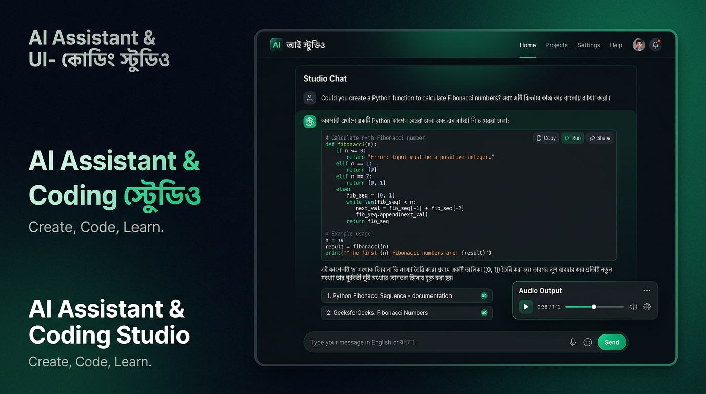
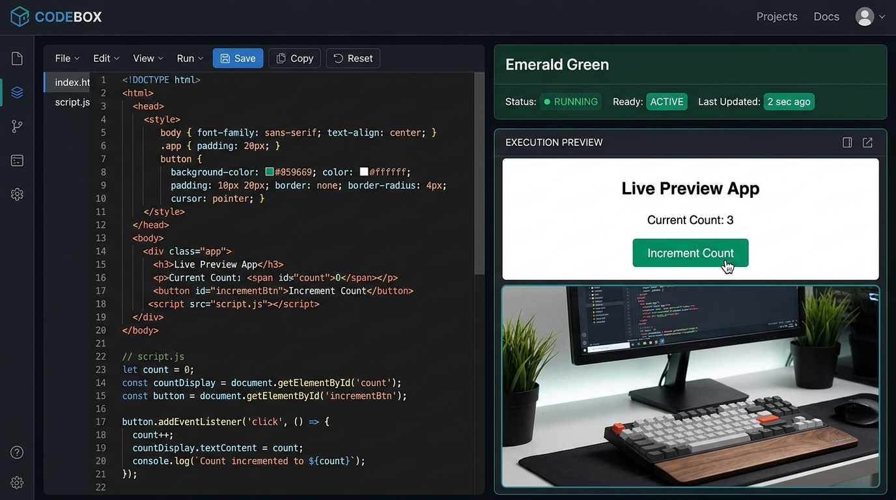
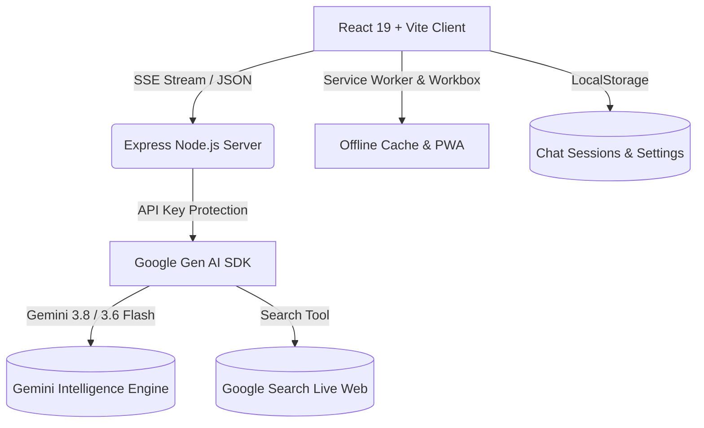

# 🇧🇩 AI Assistant & Coding Studio
### একটি আধুনিক, বুদ্ধিমান ও পূর্ণাঙ্গ দ্বিভাষিক (বাংলা ও ইংরেজি) এআই অ্যাসিস্ট্যান্ট এবং কোডিং ওয়ার্কস্পেস

<p align="center">
  
</p>

<p align="center">
  <strong>বাংলা ও ইংরেজি ভাষায় কোডিং, লেখালেখি, গবেষণা, রিয়েল-টাইম গুগল সার্চ ও ব্রাউজার কোড এক্সিকিউশন সহ অল-ইন-ওয়ান এআই পার্টনার।</strong>
</p>

<p align="center">
  <a href="https://react.dev/"></a>
  <a href="https://www.typescriptlang.org/"></a>
  <a href="https://vitejs.dev/"></a>
  <a href="https://tailwindcss.com/"></a>
  <a href="https://ai.google.dev/"></a>
  <a href="https://web.dev/progressive-web-apps/"></a>
  <a href="LICENSE"></a>
</p>

<p align="center">
  
</p>

---

## 📌 সূচিপত্র (Table of Contents)
1. [এক নজরে পরিচিতি (Introduction)](#-এক-নজরে-পরিচিতি-introduction)
2. [প্রধান বৈশিষ্ট্যসমূহ (Key Features)](#-প্রধান-বৈশিষ্ট্যসমূহ-key-features)
3. [বিশেষজ্ঞ এআই মোডসমূহ (Specialized AI Modes)](#-বিশেষজ্ঞ-এআই-মোডসমূহ-specialized-ai-modes)
4. [প্রযুক্তিগত কাঠামো (Architecture & Tech Stack)](#-প্রযুক্তিগত-কাঠামো-architecture--tech-stack)
5. [ডিরেক্টরি ও ফাইল পরিচিতি (Project Structure)](#-ডিরেক্টরি-ও-ফাইল-পরিচিতি-project-structure)
6. [API এন্ডপয়েন্ট ও স্ট্রিমিং আর্কিটেকচার (API Endpoints)](#-api-এন্ডপয়েন্ট-ও-স্ট্রিমিং-আর্কিটেকচার-api-endpoints)
7. [সেটআপ ও ইনস্টলেশন গাইড (Setup & Installation)](#-সেটআপ-ও-ইনস্টলেশন-গাইড-setup--installation)
8. [PWA হিসেবে মোবাইল ও কম্পিউটারে ব্যবহারের উপায়](#-pwa-হিসেবে-মোবাইল-ও-কম্পিউটারে-ব্যবহারের-উপায়)
9. [নিরাপত্তা ও ডাটা প্রটেকশন (Security & Privacy)](#-নিরাপত্তা-ও-ডাটা-প্রটেকশন-security--privacy)
10. [লাইসেন্স ও অবদান (License & Contribution)](#-লাইসেন্স-ও-অবদান-license--contribution)

---

## 🚀 এক নজরে পরিচিতি (Introduction)

**AI Assistant & Coding Studio** হলো বাংলা ভাষাভাষী শিক্ষার্থী, গবেষক, কন্টেন্ট ক্রিয়েটর ও সফটওয়্যার ইঞ্জিনিয়ারদের জন্য বিশেষভাবে তৈরি একটি উৎপাদনশীল ওয়ার্কস্পেস। গুগলের সর্বাধুনিক **Gemini 3.8 Flash** মডেল দ্বারা চালিত এই প্ল্যাটফর্মে ব্যাকএন্ড রেসিলিয়েন্স (অটোমেটিক ফলব্যাক চেইন), রিয়েল-টাইম সার্চ গ্রাউন্ডিং, অফলাইন-রেডি **Progressive Web App (PWA)** এবং লাইভ স্যান্ডবক্সিং সুবিধা নিশ্চিত করা হয়েছে।

---

## 🌟 প্রধান বৈশিষ্ট্যসমূহ (Key Features)

| বৈশিষ্ট্য | বিবরণ |
| :--- | :--- |
| **🌐 রিয়েল-টাইম গুগল সার্চ** | সাম্প্রতিক সংবাদ, লাইভ স্কোর বা তথ্য অনুসন্ধানে সরাসরি গুগল সার্চ গ্রাউন্ডিং ও ক্লিকেবল সোর্স সাইটেশন। |
| **⚡ লাইভ কোড স্যান্ডবক্স** | উত্তরে আসা HTML/JS/CSS/SVG কোড সরাসরি ব্রাউজারে রান করা এবং একক ক্লিকে ফাইল আকারে ডাউনলোড। |
| **🎙️ দ্বিমুখী অডিও ও ভয়েস** | মাইক্রোফোন দিয়ে মুখে বলে টেক্সট টাইপ (STT) এবং ন্যাচারাল বাংলা ও ইংরেজিতে টেক্সট-টু-স্পিচ (TTS) অডিও শ্রবণ। |
| **🎵 ইন-অ্যাপ ইউটিউব প্লেয়ার** | গানের লিংক বা রিকমেন্ডেশনের সাথে মেসেজ বাবেলের ভেতরেই মিনি প্লেয়ার ও ব্যাকগ্রাউন্ড অডিও অ্যানিমেশন। |
| **🏷️ স্মার্ট অটো-টাইটেলিং** | প্রথম কথোপকথন শেষ হলেই এআই স্বয়ংক্রিয়ভাবে ৩-৬ শব্দের অর্থবহ ও নির্ভুল শিরোনাম তৈরি করে সেশনে যুক্ত করে। |
| **📤 প্রফেশনাল এক্সপোর্ট** | চ্যাট সেশনকে চমৎকার বাংলা ফন্ট ও মার্জিন সহ **PDF**, স্ট্রাকচার্ড **JSON** অথবা **Markdown (.md)** ফাইলে এক্সপোর্ট। |
| **📱 PWABuilder ও অফলাইন সাপোর্ট** | যেকোনো মোবাইল ও পিসিতে ইনস্টলেশন যোগ্য PWA এবং ইন্টারনেট সংযোগ বিচ্ছিন্ন হলে অফলাইন হিস্ট্রি এক্সেস। |
| **🛡️ ফলব্যাক রেসিলিয়েন্স** | সার্ভার চাপ বা কোটা লিমিট (429/503) প্রতিরোধে একাধিক অল্টারনেটিভ জেমিনাই মডেলের অটোমেটিক ফলব্যাক চেইন। |

<br />

<p align="center">
  
  <br />
  <em>চিত্র ১: ইন-অ্যাপ লাইভ কোড স্যান্ডবক্স — এইচটিএমএল, সিএসএস ও জাভাস্ক্রিপ্ট কোড তাৎক্ষণিক রান ও একক ক্লিকে ফাইল ডাউনলোড প্রিভিউ</em>
</p>

---

## 🎭 বিশেষজ্ঞ এআই মোডসমূহ (Specialized AI Modes)

অ্যাপ্লিকেশনটিতে ৫টি নির্দিষ্ট কাজের জন্য ৫টি বিশেষায়িত সিস্টেম ইনস্ট্রাকশন আর্কিটেকচার সাজানো হয়েছে:

1. **💬 সাধারণ মোড (General Mode):** প্রাত্যহিক জীবনের কথোপকথন, প্রশ্নোত্তর ও দ্রুত তথ্য সন্ধান।
2. **💻 কোডিং মোড (Coding Mode):** অ্যালগরিদম সলভিং, জটিল বাগ ফিক্সিং, কোড রিফ্যাক্টরিং এবং আধুনিক সিস্টেম আর্কিটেকচার গাইডেন্স।
3. **✍️ লেখালেখি মোড (Writing Mode):** পেশাদার ইমেইল, নিবন্ধ, অনুবাদ, সোশ্যাল মিডিয়া পোস্ট ও সৃজনশীল সাহিত্যের ভাষা রূপান্তর।
4. **🔬 গবেষণা মোড (Research Mode):** তথ্যনির্ভর গভীর অনুসন্ধান, একাডেমিক সারসংক্ষেপ, পরিসংখ্যান ও তুলনামূলক ডেটা অ্যানালাইসিস।
5. **🎓 শেখা ও টিউটোরিয়াল (Learning Mode):** কঠিন প্রযুক্তিগত বিষয়গুলো সহজ বাংলা উপমায় ধাপে ধাপে শেখানোর ইন্টারঅ্যাক্টিভ মেন্টরশিপ।

---

## 🛠️ প্রযুক্তিগত কাঠামো (Architecture & Tech Stack)



### কোর টেকনোলজি:
* **Frontend:** React 19, TypeScript 5.7, Vite 6
* **Styling:** Tailwind CSS v4, Lucide React Icons, Motion (Framer Motion)
* **Backend:** Node.js, Express, TSX, esbuild
* **AI & Search:** `@google/genai` (Gemini 3.8-flash, 3.6-flash, 3.5-flash-lite)
* **Markdown & Syntax:** `react-markdown`, `remark-gfm`, Prism-inspired clean syntax styling
* **PWA & Offline:** `vite-plugin-pwa`, Workbox, W3C Web App Manifest

---

## 📁 ডিরেক্টরি ও ফাইল পরিচিতি (Project Structure)

```text
├── server.ts                    # Express সার্ভার, API সিকিউর প্রক্সি, স্ট্রিমিং ও মডেল ফলব্যাক হ্যান্ডলার
├── index.html                   # PWA মেটা-ট্যাগ, ম্যানিফেস্ট লিঙ্ক ও গুগল ওয়েব ফন্ট লোডার
├── vite.config.ts               # Vite 6, Tailwind CSS v4 এবং VitePWA প্লাগইন কনফিগারেশন
├── tsconfig.json                # TypeScript স্ট্রং টাইপ ভ্যালিডেশন
├── package.json                 # অ্যাপের স্ক্রিপ্ট ও ডিপেন্ডেন্সি তালিকা
│
├── public/                      # স্ট্যাটিক ও PWA আইকন সম্পদ
│   ├── icon.svg                 # মূল ভেক্টর আইকন
│   ├── pwa-192x192.png          # PWA স্ট্যান্ডার্ড আইকন
│   ├── pwa-512x512.png          # PWA হাই-রেজোলিউশন আইকন
│   ├── pwa-maskable-512x512.png # অ্যান্ড্রয়েড মাস্কেবল আইকন (Safe Zone সহ)
│   ├── apple-touch-icon.png     # iOS Safari হোম স্ক্রিন আইকন
│   └── favicon.png              # ব্রাউজার ফেভিকন
│
└── src/
    ├── main.tsx                 # রুট এন্ট্রি পয়েন্ট ও সার্ভিস ওয়ার্কার অটো-রেজিস্ট্রেশন
    ├── App.tsx                  # মূল স্টেট মেশিন, সেশন ম্যানেজমেন্ট ও ইভেন্ট হ্যান্ডলিং
    ├── types.ts                 # টাইপস্ক্রিপ্ট ইন্টারফেস ও ডেটা মডেল
    │
    ├── components/
    │   ├── Header.tsx           # মোড সুইচ, সার্চ টগল, নিউ চ্যাট ও PWA ইনস্টল ট্রিগার
    │   ├── Sidebar.tsx          # সংরক্ষিত সেশন হিস্ট্রি, সার্চ ফিল্টার ও সেটিংস
    │   ├── ChatInput.tsx        # টেক্সট ইনপুট, ফাইল আপলোড ও ভয়েস টাইপিং বাটন
    │   ├── ChatMessageItem.tsx  # মেসেজ বাবল, কোড ব্লক, টিটিএস অডিও ও ইউটিউব প্লেয়ার
    │   ├── CodePreviewModal.tsx # স্যান্ডবক্স আইফ্রেমে লাইভ কোড এক্সিকিউশন
    │   ├── ExportModal.tsx      # PDF, JSON এবং Markdown ডাউনলোডার
    │   ├── PWAInstallButton.tsx # ডিভাইস-ভিত্তিক ইনস্টল গাইড ও ব্রাউজার প্রম্পট
    │   └── OfflineIndicator.tsx # রিয়েল-টাইম অফলাইন স্ট্যাটাস নোটিফিকেশন বার
    │
    ├── hooks/
    │   ├── useVoiceInput.ts     # ব্রাউজার SpeechRecognition STT হুক
    │   ├── usePWAInstall.ts     # PWA beforeinstallprompt ইভেন্ট লিসেনার
    │   └── useOnlineStatus.ts   # উইন্ডো নেটওয়ার্ক স্ট্যাটাস ট্র্যাকার
    │
    ├── data/
    │   └── prompts.ts           # বিষয়ভিত্তিক রেডিমেড বাংলা কুইক প্রম্পট লাইব্রেরি
    │
    └── utils/
        └── exportChat.ts        # প্রিন্ট-ফ্রেন্ডলি PDF, মার্জিন ও ডেটা ফরম্যাটার
```

---

## 🔌 API এন্ডপয়েন্ট ও স্ট্রিমিং আর্কিটেকচার (API Endpoints)

সার্ভারের সমস্ত রিকোয়েস্ট সিকিউর সার্ভার-সাইড প্রক্সির মাধ্যমে সুরক্ষিত:

| এন্ডপয়েন্ট | মেথড | বিবরণ |
| :--- | :--- | :--- |
| `/api/health` | `GET` | সিস্টেমের বর্তমান স্থিতি এবং API Key সক্রিয় রয়েছে কিনা তা যাচাই। |
| `/api/chat/stream` | `POST` | রিয়েল-টাইম টেক্সট স্ট্রিমিং, সার্চ গ্রাউন্ডিং মেটাডেটা ও সোর্স সাইটেশন ডেলিভারি (SSE)। |
| `/api/chat` | `POST` | নন-স্ট্রিমিং পূর্ণাঙ্গ রেসপন্স জেনারেশন। |
| `/api/session/title` | `POST` | ইউজার ও অ্যাসিস্ট্যান্টের প্রথম বার্তার ভিত্তিতে স্বয়ংক্রিয় ৩-৬ শব্দের স্মার্ট শিরোনাম তৈরি। |

---

## ⚙️ সেটআপ ও ইনস্টলেশন গাইড (Setup & Installation)

### ধাপ ১: রিপোজিটরি ক্লোন করুন
```bash
git clone https://github.com/your-username/ai-assistant-studio.git
cd ai-assistant-studio
```

### ধাপ ২: ডিপেন্ডেন্সি ইনস্টল করুন
```bash
npm install
```

### ধাপ ৩: পরিবেশ চলক (.env) তৈরি করুন
প্রজেক্টের রুট ফোল্ডারে একটি `.env` ফাইল তৈরি করুন:
```env
GEMINI_API_KEY=your_gemini_api_key_here
```
> 💡 *আপনার যদি কোনো API Key না থাকে, তবে [Google AI Studio](https://aistudio.google.com/) থেকে সম্পূর্ণ বিনামূল্যে একটি API কী সংগ্রহ করতে পারেন।*

### ধাপ ৪: ডেভেলপমেন্ট সার্ভার চালু করুন
```bash
npm run dev
```
এরপর ব্রাউজারে প্রবেশ করুন: `http://localhost:3000`

### ধাপ ৫: প্রোডাকশন বিল্ড ও রান
```bash
npm run build
npm start
```

---

## 📱 PWA হিসেবে মোবাইল ও কম্পিউটারে ব্যবহারের উপায়

| প্ল্যাটফর্ম | সহজ ইনস্টলেশন পদ্ধতি |
| :--- | :--- |
| **ডেস্কটপ (Chrome / Edge / Brave)** | ব্রাউজারের অ্যাড্রেস বারের ডানপাশে থাকা **Install** আইকনে ক্লিক করুন অথবা অ্যাপের হেডারে থাকা **"ইনস্টল • PWA"** বাটনে চাপুন। |
| **অ্যান্ড্রয়েড (Android Chrome)** | ব্রাউজার মেনুর ৩-ডটে ট্যাপ করে **"Install app"** অথবা **"Add to Home screen"** নির্বাচন করুন। |
| **আইফোন / আইপ্যাড (iOS Safari)** | নিচে থাকা **Share (শেয়ার)** বাটনে ট্যাপ করে মেনু থেকে **"Add to Home Screen"** সিলেক্ট করুন। |

<br />

<p align="center">
  
  <br />
  <em>চিত্র ২: রেসপনসিভ মোবাইল ও ট্যাবলেট PWA অভিজ্ঞতা — ভয়েস স্পিচ-টু-টেক্সট টাইপিং এবং ফ্লোটিং অডিও প্লেয়ার বার</em>
</p>

---

## 🔒 নিরাপত্তা ও ডাটা প্রটেকশন (Security & Privacy)

1. **সার্ভার সাইড সিকিউরিটি:** ব্যবহারকারীর কোনো এপিআই কী ক্লায়েন্ট ব্রাউজারে এক্সপোজ হয় না। সকল কল এক্সপ্রেস সার্ভারের মাধ্যমে প্রক্সি করা হয়।
2. **লোকাল প্রাইভেসি:** ব্যবহারকারীর চ্যাট সেশন, সার্চ হিস্ট্রি এবং থিম সেটিংস একান্তই ব্যবহারকারীর ব্রাউজারের লোকাল স্টোরেজে থাকে।
3. **সার্চ সেফটি:** সার্চ গ্রাউন্ডিং চালুর মাধ্যমে নির্ভরযোগ্য ও ফ্যাক্ট-চেকড উত্তরের সাথে সরাসরি মূল সোর্সের সাইটেশন প্রদান করা হয়।

---

## 📄 লাইসেন্স ও অবদান (License & Contribution)

প্রজেক্টটি [MIT License](LICENSE)-এর অধীনে উন্মুক্ত ও ওপেন সোর্স। যেকোনো ধরনের পরামর্শ, বাগ রিপোর্ট বা পুল রিকোয়েস্ট (PR) সাদরে গ্রহণযোগ্য।

---

<p align="center">
  তৈরি করা হয়েছে ভালোবাসার সাথে ❤️ বাংলাভাষী ডেভেলপার, শিক্ষার্থী ও প্রযুক্তিপ্রেমীদের জন্য।<br />
  <sub>Made with React, Tailwind CSS, Google Gemini & Open Web Standards</sub>
</p>
